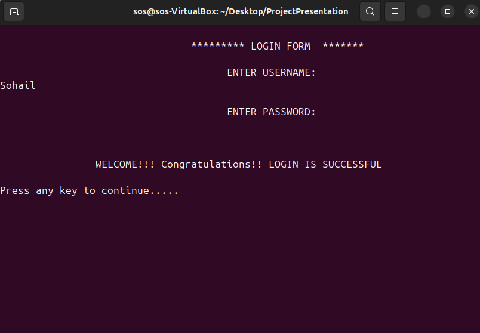
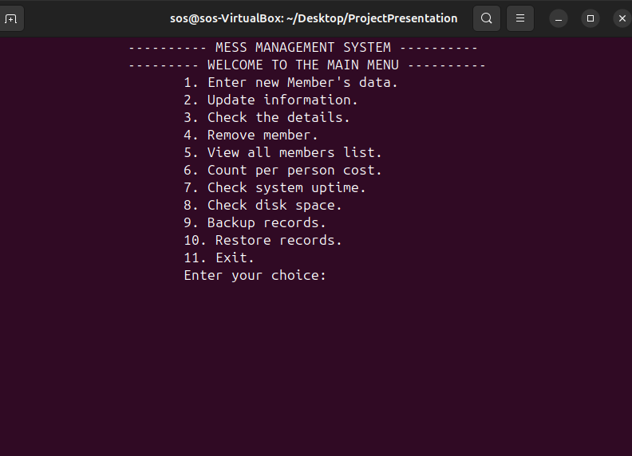

# Mess Management System (Bash)

A simple menu-driven command-line application built using Bash scripting on Linux to manage mess member records and basic operations.

---

## 🚀 Features

- Add, update, and delete member records  
- View member details and full list  
- Calculate per-person cost  
- File-based data storage  
- Basic login system  
- Backup and restore data  

---

## 🛠️ Tech Stack

- Bash Scripting  
- Linux Command Line  

---

## 📸 Screenshots

### Login


### Main Menu


---

## ▶️ How to Run

```bash
chmod +x project.sh
./project.sh
